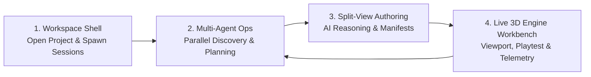

<p align="center">
  
</p>

<h1 align="center">Bhippi ADE</h1>

<p align="center">
  <strong>Build playable 3D games with AI agents and a live Godot 4 engine in one local-first desktop studio.</strong>
</p>

<p align="center">
  <a href="https://github.com/memegyanfactory-gif/BhippiADE/actions/workflows/ci.yml"></a>
  
  
  
  
  
  
</p>

<p align="center">
  <a href="#overview">Overview</a> ·
  <a href="#product-tour--workflow">Product Tour & Workflow</a> ·
  <a href="#full-architecture--structure">Architecture & Structure</a> ·
  <a href="#capabilities">Capabilities</a> ·
  <a href="#safety-invariants">Safety Invariants</a> ·
  <a href="#quick-start">Quick start</a> ·
  <a href="#quality-and-verification">Quality</a>
</p>

<p align="center">
  
</p>

<p align="center"><em>Bhippi ADE: One unified desktop studio for AI collaboration, live Godot 4 3D viewport authoring, code editing, web research, play inspection, and version recovery.</em></p>

> [!IMPORTANT]
> Bhippi is under active development. Windows is the primary desktop target today; core Rust validation also runs on macOS and Linux. The engine runtime is Godot 4 (pinned 4.7.1).

---

## Overview

**Bhippi ADE** is a local-first, AI-native desktop game development studio built with **Rust**, **Tauri 2**, **React 18**, and **Godot 4**. You describe a game, Bhippi plans it, builds it inside a real Godot 4 project, plays it, and iterates — every change typed, journaled, undoable, and measured.

**The engine is Godot; Bhippi is the studio around it.**

Instead of letting AI models generate unvalidated text files or hallucinate engine formats, Bhippi enforces a rigorous Rust-owned boundary:
- **Godot 4 is the runtime authority**: Rendering, physics, animation, and scene graphs belong to Godot.
- **Typed transactional actions**: AI agents mutate projects strictly through typed actions. Raw `.tscn` and `project.godot` writes are forbidden.
- **Preflight compilation**: Every GDScript modification is check-compiled before touching disk.
- **Deterministic telemetry**: The autoloaded `BhippiProbe` injects inputs and captures frame metrics during headless and interactive playtests.
- **Bounded computer use**: Vision-capable agent actions are strictly confined to the launched game window with hard action caps and immediate `Esc/Esc` emergency abort.

---

## Product Tour & Workflow

Building a game in Bhippi ADE follows a structured, fail-closed lifecycle where human developers and AI models collaborate across a shared, live Godot 4 engine project.



---

### 1. Clean Project Workspace & Onboarding Shell

Every session in Bhippi ADE is anchored to a real project directory on your local drive. Opening a project brings you into a distraction-free shell designed for rapid session bootstrapping without cognitive overload.

<p align="center">
  
</p>

<p align="center"><em>Zero-clutter project onboarding shell ready to spin up conversational agents or embedded CLI terminals.</em></p>

- **Instant Session Spawning**: Launch a new **AI Agent Chat** or an **Embedded CLI** terminal that automatically initializes within the active project root.
- **Adaptive Surface Switcher**: Instantly toggle between `Single` agent focus, `Multi` agent canvas, or open the integrated `Editor` and `Engine` views from the header.
- **Context-Aware Directory Anchor**: All commands, file explorations, and git operations execute with strict containment inside the selected game project directory.
- **Persistent Project Navigation**: Quick access to pinned projects (`demo 3`, `chai stack`, `08_Wire_City`, `06_Tiffin_Run`), active background tasks (`1 active`), and lifetime activation state.

---

### 2. Concurrent Multi-Agent Operations

Bhippi ADE's **Multi Mode** unlocks a concurrent AI operations center. Run multiple frontier models simultaneously on the same Godot 4 codebase to divide and conquer architecture, logic, asset pipelines, and telemetry in parallel.

<p align="center">
  
</p>

<p align="center"><em>Four concurrent agent sessions (Grok 4.6, GPT-5 Codex, Big-Pickle / OpenCode) inspecting game manifests, scenes, scripts, and plans in parallel.</em></p>

- **Parallel Provider Execution**: Run distinct model families side-by-side (e.g. Claude Code, GPT-5 Codex, Grok 4.6, Big-Pickle, OpenCode, or local Ollama) with flexible drag-and-drop column layout.
- **Autonomous Project Discovery**: Agents independently inspect project manifests (`Bhippi.game.toml`), parse Godot scenes (`scenes/main.tscn`), review scripts (`scripts/main.gd`), read GDD plans (`Plan/`), and verify autoload telemetry (`BhippiProbe`).
- **Live Execution Supervision**: Real-time progress indicators (`Running`, `Idle`), execution timers, step tracking (e.g., `11 active steps`), and token spend meters.
- **Safe Change Isolation & Review**: Staged modifications remain buffered in a non-destructive review state. Use the `Review Changes` panel to inspect full diffs before committing any mutation to disk.
- **Immediate Abort**: Emergency stop button terminates running agent workflows instantly if an unexpected direction is detected.

---

### 3. AI Reasoning & Code Split-View Authoring

Bridge natural language intent with concrete code generation through the integrated split view. Creators maintain full oversight as AI agents draft changes alongside the live project source and declarative manifests.

<p align="center">
  
</p>

<p align="center"><em>Split-screen authoring: conversational agent reasoning on the left, live source manifest and file tree on the right.</em></p>

- **Co-Pilot Understanding**: The agent explains its understanding of the game workspace (e.g., detecting `chai stack` with `Node3D`, `DirectionalLight3D`, and `Camera3D`) and proposes next steps.
- **Declarative `Bhippi.game.toml`**: Inspect and configure your game manifest directly:
  - **Runtime & Version Pin**: Pinned to Godot `4.7.1` with Forward+ 3D render pipeline.
  - **Telemetry Autoload**: Toggle `probe = true` to inject `BhippiProbe` for automated playtest telemetry and headless input replay.
  - **Render & Physics**: Configure MSAA anti-aliasing and gravity vectors (`[0.0, -9.8, 0.0]`).
  - **Multi-Platform Targets**: Build configurations for Windows, Android (`min_sdk = 24`), and iOS.
- **Synchronized Exploration**: As agents examine files or prepare edits, the project explorer highlights touched files and opens relevant documents in real time.
- **Zero Hallucination Loop**: Every action proposed by the agent crosses Bhippi's Rust transaction boundary, ensuring typed schema validation and preflight syntax checking before application.

---

### 4. Live Godot 4 3D Viewport & Studio Workbench

The core runtime foundation of Bhippi ADE: a live, embedded Godot 4 3D engine viewport integrated directly alongside your AI command deck and developer tooling.

<p align="center">
  
</p>

<p align="center"><em>Live Godot 4 3D engine viewport with perspective grid, transform gizmos, AI command deck, transport controls, and 10 docked bottom panels.</em></p>

- **Real-Time 3D Viewport**: Embedded Godot 4 Forward+ 3D engine viewport featuring 3D perspective grids, coordinate axes, camera navigation, and transform toolbars (Select, Move, Rotate, Scale, Lock).
- **AI Command Deck**: Conversational interface with quick suggestion chips (*"Build a top-down dungeon crawler"*, *"Add a health bar to the HUD"*, *"Make the sky stormy and dim the sun"*, *"Playtest level 1 and report what breaks"*).
- **One-Click Transport Controls**:
  - `Play`: Launch the live game scene immediately.
  - `Playtest`: Run automated scenario-driven playtests with scripted input injection.
  - `Watch play`: Supervise headless agent playtests with live visual feedback.
  - `Preview` & `Export`: Package builds for desktop and mobile targets.
- **10 Docked Bottom Panels**: Expandable drawers for `Output`, `Debugger`, `Audio`, `Animation`, `Shader Editor`, `Assets`, `Library`, `Code`, `Console`, and `Versions` (SQLite transaction journal recovery).
- **Engine Status Supervision**: Live Godot version badge (`4.7.1.stable`), workspace status, and process heartbeat monitoring.

---

## Full Architecture & Structure

Bhippi ADE is structured around strict separation of concerns: **Rust owns authority, safety, transactions, and engine supervision; TypeScript renders the desktop studio; Godot 4 executes the game.**

```
+-----------------------------------------------------------------------------------------+
|                                  React 18 Studio UI                                     |
|  Live 3D Viewport * Multi-Agent Canvas * Code & Manifest Editor * Browser * Dock Drawers|
+--------------------------------------------+--------------------------------------------+
                                             | generated, type-safe Tauri IPC (Specta)
                                             v
+-----------------------------------------------------------------------------------------+
|                               crates/bhippi-app (Tauri 2)                               |
|       Desktop runtime * Window management * Native menus * Godot process supervisor     |
+-------------------+-------------------+--------------------+--------------------+-------+
                    |                   |                    |                    |
                    v                   v                    v                    v
+-----------------------+ +-----------------+ +------------------+ +----------------------+
|  crates/bhippi-engine | |crates/bhippi-core| |crates/bhippi-    | | crates/bhippi-memory |
|  Godot bridge & probe | |Orchestration bus| |   providers      | | Long-term memory     |
|  Typed action batching| |Context routing  | |Claude/GPT/Grok/  | | Episodic recall      |
|  GDScript preflight   | |Budgets & events | |  OpenCode/Ollama | | Vector cache         |
|  Safety/release gates | |Cancellation     | |Stream & token mtr| |                      |
+-----------+-----------+ +--------+--------+ +--------+---------+ +----------+-----------+
            |                      |                   |                      |
            +----------------------+---------+---------+----------------------+
                                             |
                                             v
+-----------------------------------------------------------------------------------------+
|                 crates/bhippi-types (Shared domain types & protocols)                   |
+--------------------------------------------+--------------------------------------------+
                                             |
                                             v
+-----------------------------------------------------------------------------------------+
|             crates/bhippi-db (SQLite journals, transactions, recovery & metadata)       |
+-----------------------------------------------------------------------------------------+
                                             |
                                             v
+-----------------------------------------------------------------------------------------+
|                           Godot 4 Engine Runtime (v4.7.1)                               |
|        Forward+ 3D Renderer * Physics * Scenes (.tscn) * BhippiProbe (probe.gd)         |
+-----------------------------------------------------------------------------------------+
```

### Workspace Repository Layout

```text
BhippiADE/
├── .github/
│   ├── assets/                  Public screenshots and architectural diagrams
│   └── workflows/ci.yml         GitHub Actions CI (Rust fmt/clippy/test, UI build/test)
├── crates/                      Rust workspace crates (business domain & authority)
│   ├── bhippi-app/              Tauri 2 desktop shell, window lifecycle, Godot supervisor, bindings export
│   ├── bhippi-core/             Event bus, multi-agent session lifecycle, context assembly, cancellation
│   ├── bhippi-db/               SQLite migrations, repositories, journals, design intelligence database
│   ├── bhippi-engine/           Godot 4 bridge, typed transactions, GDScript preflight, safety gates, probe
│   ├── bhippi-memory/           Long-term episodic memory, vector/embedding cache, contextual recall
│   ├── bhippi-providers/        Model adapters (Claude, Codex, Grok, Kimi, OpenCode, Ollama), token tracking
│   ├── bhippi-skills/           Agent skill packs, tool definitions, game mechanics rulesets
│   └── bhippi-types/            Shared protocol types, Specta schemas, serialization contracts
├── docs/                        System specifications, ADRs, and architectural blueprints
│   ├── adr/                     Architectural Decision Records (ADR-0042, ADR-0043, ADR-0044)
│   ├── 00-SPEC-v2.0.md          System specification and non-negotiables
│   ├── 01-ARCHITECTURE.md       Subsystem architecture and process model
│   ├── 02-MODULE-CONTRACTS.md   Crate API contracts and boundaries
│   ├── 06-INVARIANTS.md         Safety, capability, and database invariants
│   ├── 16-GAME-ADE-PLAN.md      Game ADE master implementation roadmap
│   └── 18-DESIGN-INTELLIGENCE...Design intelligence and taste loop architecture
├── prompts/                     Versioned model-facing system instructions
├── tests/fixtures/              Deterministic test scenes, scripts, and asset fixtures
└── ui/                          React 18 + TypeScript + Vite desktop frontend
    ├── src/
    │   ├── chrome/              Sidebar, TitleBar, StatusBar, dependency modals, auto-update
    │   ├── components/          Shared UI components, popovers, token usage meters, aura
    │   ├── lib/                 Typed IPC bindings (ipc.ts), game launcher, API adapters
    │   ├── screens/             Studio, Projects, Games, Assets, Add-ons, Settings, Usage
    │   ├── studio/              Embedded Godot viewport, studio header, bottom dock, chat tabs
    │   ├── workbench/           Workbench host, integrated browser, code editor, mode switcher
    │   └── workspace/           Multi-session canvas, drag-and-drop session organizer
    └── tests/                   Vitest / Node integration and UI test suite
```

### Authored Game Project Structure

Every game project managed by Bhippi ADE follows a clean, standard Godot 4 directory structure enriched with declarative metadata and telemetry hooks:

```text
my-game-project/
├── Bhippi.game.toml             Declarative manifest (version pin, render pipeline, physics, targets)
├── project.godot                Godot 4 engine project file (owned by Godot & typed actions)
├── bhippi/                      Bhippi engine runtime integration
│   └── probe.gd                 Autoloaded probe for headless telemetry, input injection, and play metrics
├── addons/                      Engine addons and studio plugins
│   └── bhippi_studio/           Godot studio integration plugin
├── scenes/                      Authored Godot scene files (.tscn) created via typed actions
│   └── main.tscn                Primary scene entry point
├── scripts/                     Authored GDScript files (.gd) check-compiled before writing
│   └── main.gd                  Scene logic and probe event hooks
├── Plan/                        Game design documents (.docx, .md) and rulebooks
└── export_presets.cfg           Export configurations for Windows, Android, iOS, Web
```

---

## Capabilities

### AI-Native Workspace

- **Project-Scoped Sessions**: Chats and CLI sessions maintain independent context drafts anchored to the project root.
- **Single & Multi-Agent Modes**: Focus on a single agent conversation or operate 4+ models simultaneously with drag-and-drop column reordering.
- **Provider Independence**: Seamlessly route to Claude Code, OpenAI/Codex, Grok, Kimi, OpenCode, or local Ollama instances with live model selection.
- **Real-Time Telemetry & Spend**: Visible token consumption meters, step tracking, active execution timers, and typed fault reporting.
- **Safe Change Reviews**: Interactive diff inspector shows staged file changes before they are committed to disk.

### Godot 4 Engine Integration

- **Live 3D Viewport**: Embedded Godot 4 viewport with perspective navigation, 3D grid, and camera controls.
- **Transport Controls**: One-click `Play`, `Playtest`, and `Watch play` commands supervise the engine process.
- **Integrated Dock Drawers**: 10 docked tabs for `Output`, `Debugger`, `Audio`, `Animation`, `Shader Editor`, `Assets`, `Library`, `Code`, `Console`, and `Versions`.
- **`BhippiProbe` Telemetry**: Headless or interactive input injection with real-time frame telemetry, player position, and physics state reporting.
- **Versioned Checkpoints**: Create snapshots and revert changes through SQLite transaction journals.

### Game-Aware Debugging (`/gamedebug`)

`/gamedebug` executes a structured engine-owned diagnostic pipeline and generates an immutable, AI-ready report under `.bhippi/reports/game-debug/`:

```text
/gamedebug
/gamedebug quick
/gamedebug full
/gamedebug release
/gamedebug full --fix
```

Reports provide concrete diagnostic findings (missing nodes, broken script references, collider misalignments) that agents can resolve deterministically without guessing from raw terminal logs.

---

## Safety Invariants

Bhippi ADE enforces strict, non-negotiable safety rules in code:

| Rule | Enforcement |
| --- | --- |
| **1. Godot is the runtime authority** | Never re-implement a renderer, physics solver, or custom scene format. |
| **2. Zero raw scene/script writes** | Typed actions only. GDScript is check-compiled before writing; `.tscn` and `project.godot` are never hand-written raw. |
| **3. Bounded Computer Use** | Vision-guided actions are strictly constrained to the launched game window with an action cap and `Esc/Esc` emergency abort. |
| **4. Zero `unwrap()` outside tests** | Rust workspace lint policy denies `unwrap()` and `expect()` outside unit tests (`unwrap_used = "deny"`). |
| **5. Strict SQL isolation** | All SQL queries are encapsulated inside `bhippi-db`. |
| **6. No prompt strings in code** | All system and model-facing prompts are versioned files inside `prompts/`. |
| **7. Release gates block** | Safety, licence, accessibility, and build gates block execution — they never silently warn. |

---

## Quick start

### Prerequisites

| Requirement | Recommended Version |
| --- | --- |
| **Rust** | Stable 1.85 or newer |
| **Node.js** | 22 LTS with npm |
| **Godot Engine** | Godot 4.3+ (pinned 4.7.1 for projects) |
| **Desktop Webview** | Microsoft Edge WebView2 (Windows) / WebKit (macOS/Linux) |
| **C++ Build Tools** | Platform dependencies required by Tauri 2 |

See the official [Tauri prerequisites](https://v2.tauri.app/start/prerequisites/) for your operating system.

### Build and Run

```bash
# 1. Clone the repository
git clone https://github.com/memegyanfactory-gif/BhippiADE.git
cd BhippiADE

# 2. Install UI dependencies and build frontend assets
npm ci --prefix ui
npm run build --prefix ui

# 3. Export typed IPC bindings (optional, verifies synchronization)
cargo run -p bhippi-app --bin export-bindings

# 4. Launch the desktop studio
cargo run -p bhippi-app --bin bhippi-desktop
```

---

## Quality and Verification

Run the full verification suite expected by CI:

```bash
# Rust code format check
cargo fmt --all -- --check

# Rust workspace clippy lints (fails on any warning)
cargo clippy --workspace --all-targets -- -D warnings

# Rust unit and integration tests
cargo test --workspace

# Frontend tests and production build
npm test --prefix ui
npm run build --prefix ui

# Verify IPC bindings are up to date
cargo run -p bhippi-app --bin export-bindings
git diff --exit-code -- ui/src/lib/ipc.ts
```

---

## Contributing

Contributions should preserve the Rust/TypeScript ownership boundary, fail closed when validation cannot prove safety, and include tests proportional to the change.

1. Review [CONTRIBUTING.md](CONTRIBUTING.md) and [docs/07-AGENT-GUIDE.md](docs/07-AGENT-GUIDE.md).
2. Run the quality checks above before opening a pull request.
3. Bug reports should include OS version, reproduction steps, expected behavior, and anonymized logs.

---

## License

Bhippi is licensed under the GNU Affero General Public License v3.0 only (`AGPL-3.0-only`). See [LICENSE](LICENSE).
