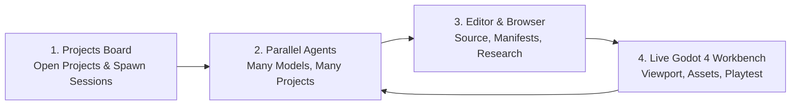

<p align="center">
  
</p>

<h1 align="center">Bhippi ADE</h1>

<p align="center">
  <strong>Build playable 3D games with AI agents and a live Godot 4 engine in one local-first desktop studio.</strong>
</p>

<p align="center">
  <a href="https://github.com/memegyanfactory-gif/BhippiADE/actions/workflows/ci.yml"></a>
  
  
  
  
  
  
</p>

<p align="center">
  <a href="#overview">Overview</a> ·
  <a href="#product-tour--workflow">Product Tour & Workflow</a> ·
  <a href="#full-architecture--structure">Architecture & Structure</a> ·
  <a href="#capabilities">Capabilities</a> ·
  <a href="#safety-invariants">Safety Invariants</a> ·
  <a href="#quick-start">Quick start</a> ·
  <a href="#quality-and-verification">Quality</a>
</p>

<p align="center">
  
</p>

<p align="center"><em>One window: the agent that is building the game, and the Godot 4 editor it is building it in.</em></p>

> [!IMPORTANT]
> Bhippi is under active development. Windows is the primary desktop target today; core Rust validation also runs on macOS and Linux. The engine runtime is Godot 4 (pinned 4.7.1).

---

## Overview

**Bhippi ADE** is a local-first, AI-native desktop game development studio built with **Rust**, **Tauri 2**, **React 18**, and **Godot 4**. You describe a game, Bhippi plans it, builds it inside a real Godot 4 project, plays it, and iterates — every change typed, journaled, undoable, and measured.

**The engine is Godot; Bhippi is the studio around it.**

Instead of letting AI models generate unvalidated text files or hallucinate engine formats, Bhippi enforces a rigorous Rust-owned boundary:
- **Godot 4 is the runtime authority**: Rendering, physics, animation, and scene graphs belong to Godot.
- **Typed transactional actions**: AI agents mutate projects strictly through typed actions. Raw `.tscn` and `project.godot` writes are forbidden.
- **Preflight compilation**: Every GDScript modification is check-compiled before touching disk.
- **Deterministic telemetry**: The autoloaded `BhippiProbe` injects inputs and captures frame metrics during headless and interactive playtests.
- **Bounded computer use**: Vision-capable agent actions are strictly confined to the launched game window with hard action caps and immediate `Esc/Esc` emergency abort.

---

## Product Tour & Workflow

Building a game in Bhippi ADE follows a structured, fail-closed lifecycle where human developers and AI models collaborate across a shared, live Godot 4 engine project.



---

### 1. The Projects Board

Every session is anchored to a real folder on your drive. The board is what you open onto: your
projects on the left, pinned ones held at the top, and a canvas that fills with windows as you
start work.

<p align="center">
  
</p>

<p align="center"><em>An empty board. A chat or a terminal opens as a window on it.</em></p>

- **Three surfaces, one window.** `Single` is one conversation, `Multi` is a canvas of them, and
  `Projects` spans every project you have open at once.
- **Sessions open as windows.** Start an **AI chat** or an **embedded CLI** and it takes a place on
  the board, tiled, movable and resizable rather than buried in a tab.
- **Pinned projects hold their place.** Pinned rows form a stable group at the top that dragging
  cannot displace. Pin, add a session, or open the card's overflow directly from the row.
- **Every command is contained.** File reads, git operations and agent edits all run inside the
  project root they belong to.

---

### 2. Parallel Agents, Across Projects

Different model families, running at the same time, on the same board — and not necessarily on the
same game. Each window carries its own provider, its own state and its own diff.

<p align="center">
  
</p>

<p align="center"><em>Three agents, two projects, three providers: Gemini 3.8 Flash reading a build spec, Claude Opus working on the HUD, and OpenCode surveying a second game.</em></p>

- **Mix providers freely.** Claude, Gemini, GPT-5 Codex, Grok, OpenCode / Big Pickle, or a local
  model — side by side, each window on whichever one suits the job.
- **Every window says what it is doing.** `Running` or `Idle`, elapsed time, the step it is on, and
  the files it has read so far.
- **A live diff per session.** `15 files with changes +3446 −837` is measured against what each file
  held before the agent first touched it, so it counts deletions and works whether or not the
  project is a git repository.
- **Review before it lands.** `Review Changes` opens the full diff, unified or side by side.
- **Stop means stop.** One press ends the turn; `Esc` twice is the emergency stop for anything
  driving the desktop.

---

### 3. Editor and Browser, Beside the Work

The right-hand panel is whatever the work needs: the project's own source, or the web — without
leaving the studio or losing the conversation.

<p align="center">
  
</p>

<p align="center"><em>The manifest that pins the engine, open beside the agents editing the project it describes.</em></p>

- **The declarative `Bhippi.game.toml`.** Engine track and version pin (Godot `4.7.1`), render
  pipeline and MSAA, physics backend and gravity, export targets for Windows, Android and iOS, and
  the `probe = true` autoload that makes playtests measurable.
- **A real file tree.** `.bhippi`, `.godot`, `addons`, `assets`, `Plan`, `scenes`, `scripts` — the
  project as it actually sits on disk, with the file the agent is touching opened as it works.

<p align="center">
  
</p>

<p align="center"><em>The same panel, switched to the browser: documentation and references without leaving the studio.</em></p>

- **Editor or Browser, one toggle.** Look something up, read an engine doc, or check a store page
  with the agents still running beside it.

---

### 4. The Live Godot 4 Workbench

The runtime foundation: a real Godot 4 editor embedded beside the agent that is driving it. Not a
preview, and not a re-implementation — the engine itself.

<p align="center">
  
</p>

<p align="center"><em>A 3D runner mid-build: the scene open in the viewport, the agent working on its HUD, and the whole studio around them.</em></p>

- **The real viewport.** Godot 4 Forward+ with perspective and orthogonal views, transform gizmos,
  the axis widget and the scene tabs of the game being built (`main`, `start_screen`,
  `touch_joystick`, `splash`, `jelly_shift_rush`).
- **Assets without leaving.** Search Sketchfab from the workbench, filter to **shippable only**
  licences, and import straight into the project — every asset landing with its licence recorded
  beside it.
- **Transport controls.** `Play` runs the game, `Playtest` runs it with scripted input, `Watch play`
  supervises a headless run, and `Preview` / `Export` package it.
- **Twelve docked panels.** `Output`, `Debugger`, `Audio`, `Animation` and `Shader Editor` from the
  engine; `Assets`, `Library`, `HUD`, `Splash`, `Code`, `Console` and `Versions` from Bhippi — the
  last being the transaction journal every applied change can be rolled back through.
- **The engine says which one it is.** A live `4.7.1.stable` badge, workspace state, and process
  heartbeat, so a stalled child is visible rather than inferred.

---

## Full Architecture & Structure

Bhippi ADE is structured around strict separation of concerns: **Rust owns authority, safety, transactions, and engine supervision; TypeScript renders the desktop studio; Godot 4 executes the game.**

```
+-----------------------------------------------------------------------------------------+
|                                  React 18 Studio UI                                     |
|  Live 3D Viewport * Multi-Agent Canvas * Code & Manifest Editor * Browser * Dock Drawers|
+--------------------------------------------+--------------------------------------------+
                                             | generated, type-safe Tauri IPC (Specta)
                                             v
+-----------------------------------------------------------------------------------------+
|                               crates/bhippi-app (Tauri 2)                               |
|       Desktop runtime * Window management * Native menus * Godot process supervisor     |
+-------------------+-------------------+--------------------+--------------------+-------+
                    |                   |                    |                    |
                    v                   v                    v                    v
+-----------------------+ +-----------------+ +------------------+ +----------------------+
|  crates/bhippi-engine | |crates/bhippi-core| |crates/bhippi-    | | crates/bhippi-memory |
|  Godot bridge & probe | |Orchestration bus| |   providers      | | Long-term memory     |
|  Typed action batching| |Context routing  | |Claude/GPT/Grok/  | | Episodic recall      |
|  GDScript preflight   | |Budgets & events | |  OpenCode/Ollama | | Vector cache         |
|  Safety/release gates | |Cancellation     | |Stream & token mtr| |                      |
+-----------+-----------+ +--------+--------+ +--------+---------+ +----------+-----------+
            |                      |                   |                      |
            +----------------------+---------+---------+----------------------+
                                             |
                                             v
+-----------------------------------------------------------------------------------------+
|                 crates/bhippi-types (Shared domain types & protocols)                   |
+--------------------------------------------+--------------------------------------------+
                                             |
                                             v
+-----------------------------------------------------------------------------------------+
|             crates/bhippi-db (SQLite journals, transactions, recovery & metadata)       |
+-----------------------------------------------------------------------------------------+
                                             |
                                             v
+-----------------------------------------------------------------------------------------+
|                           Godot 4 Engine Runtime (v4.7.1)                               |
|        Forward+ 3D Renderer * Physics * Scenes (.tscn) * BhippiProbe (probe.gd)         |
+-----------------------------------------------------------------------------------------+
```

### Workspace Repository Layout

```text
BhippiADE/
├── .github/
│   ├── assets/                  Public screenshots and architectural diagrams
│   └── workflows/ci.yml         GitHub Actions CI (Rust fmt/clippy/test, UI build/test)
├── crates/                      Rust workspace crates (business domain & authority)
│   ├── bhippi-app/              Tauri 2 desktop shell, window lifecycle, Godot supervisor, bindings export
│   ├── bhippi-core/             Event bus, multi-agent session lifecycle, context assembly, cancellation
│   ├── bhippi-db/               SQLite migrations, repositories, journals, design intelligence database
│   ├── bhippi-engine/           Godot 4 bridge, typed transactions, GDScript preflight, safety gates, probe
│   ├── bhippi-memory/           Long-term episodic memory, vector/embedding cache, contextual recall
│   ├── bhippi-providers/        Model adapters (Claude, Codex, Grok, Kimi, OpenCode, Ollama), token tracking
│   ├── bhippi-skills/           Agent skill packs, tool definitions, game mechanics rulesets
│   └── bhippi-types/            Shared protocol types, Specta schemas, serialization contracts
├── docs/                        System specifications, ADRs, and architectural blueprints
│   ├── adr/                     Architectural Decision Records (ADR-0042, ADR-0043, ADR-0044)
│   ├── 00-SPEC-v2.0.md          System specification and non-negotiables
│   ├── 01-ARCHITECTURE.md       Subsystem architecture and process model
│   ├── 02-MODULE-CONTRACTS.md   Crate API contracts and boundaries
│   ├── 06-INVARIANTS.md         Safety, capability, and database invariants
│   ├── 16-GAME-ADE-PLAN.md      Game ADE master implementation roadmap
│   └── 18-DESIGN-INTELLIGENCE...Design intelligence and taste loop architecture
├── prompts/                     Versioned model-facing system instructions
├── tests/fixtures/              Deterministic test scenes, scripts, and asset fixtures
└── ui/                          React 18 + TypeScript + Vite desktop frontend
    ├── src/
    │   ├── chrome/              Sidebar, TitleBar, StatusBar, dependency modals, auto-update
    │   ├── components/          Shared UI components, popovers, token usage meters, aura
    │   ├── lib/                 Typed IPC bindings (ipc.ts), game launcher, API adapters
    │   ├── screens/             Studio, Projects, Games, Assets, Add-ons, Settings, Usage
    │   ├── studio/              Embedded Godot viewport, studio header, bottom dock, chat tabs
    │   ├── workbench/           Workbench host, integrated browser, code editor, mode switcher
    │   └── workspace/           Multi-session canvas, drag-and-drop session organizer
    └── tests/                   Vitest / Node integration and UI test suite
```

### Authored Game Project Structure

Every game project managed by Bhippi ADE follows a clean, standard Godot 4 directory structure enriched with declarative metadata and telemetry hooks:

```text
my-game-project/
├── Bhippi.game.toml             Declarative manifest (version pin, render pipeline, physics, targets)
├── project.godot                Godot 4 engine project file (owned by Godot & typed actions)
├── bhippi/                      Bhippi engine runtime integration
│   └── probe.gd                 Autoloaded probe for headless telemetry, input injection, and play metrics
├── addons/                      Engine addons and studio plugins
│   └── bhippi_studio/           Godot studio integration plugin
├── scenes/                      Authored Godot scene files (.tscn) created via typed actions
│   └── main.tscn                Primary scene entry point
├── scripts/                     Authored GDScript files (.gd) check-compiled before writing
│   └── main.gd                  Scene logic and probe event hooks
├── Plan/                        Game design documents (.docx, .md) and rulebooks
└── export_presets.cfg           Export configurations for Windows, Android, iOS, Web
```

---

## Capabilities

### AI-Native Workspace

- **Project-Scoped Sessions**: Chats and CLI sessions maintain independent context drafts anchored to the project root.
- **Single & Multi-Agent Modes**: Focus on a single agent conversation or operate 4+ models simultaneously with drag-and-drop column reordering.
- **Provider Independence**: Seamlessly route to Claude Code, OpenAI/Codex, Grok, Kimi, OpenCode, or local Ollama instances with live model selection.
- **Real-Time Telemetry & Spend**: Visible token consumption meters, step tracking, active execution timers, and typed fault reporting.
- **Safe Change Reviews**: A review ledger records what every file held before Bhippi first touched it, so the diff shows real additions *and* deletions, updates while the turn runs, and works in a project that is not a git repository. Inspect it unified or side by side before anything is committed.
- **Built-in Browser**: Documentation, engine references and store pages in the same window, beside the agents rather than instead of them.

### Godot 4 Engine Integration

- **Live 3D Viewport**: Embedded Godot 4 viewport with perspective navigation, 3D grid, and camera controls.
- **Transport Controls**: One-click `Play`, `Playtest`, and `Watch play` commands supervise the engine process.
- **Integrated Dock Drawers**: 12 docked tabs — `Output`, `Debugger`, `Audio`, `Animation` and `Shader Editor` from the engine, plus `Assets`, `Library`, `HUD`, `Splash`, `Code`, `Console` and `Versions` from Bhippi.
- **HUD Library**: Buildable HUD presets expanded into a real editable `hud.tscn` and the GDScript that drives it, refused at build time if a readout is too small, too crowded, or sitting where the game needs the screen.
- **Splash Screens**: Describe the card a game opens on, upload a logo, and it is built into the project and made the boot scene — held for three to five seconds, skippable, and exportable as an SVG for a store page.
- **Licensed Asset Import**: Search Sketchfab from the workbench, filter to shippable licences only, and import into the project with the terms recorded in a sidecar beside every file.
- **`BhippiProbe` Telemetry**: Headless or interactive input injection with real-time frame telemetry, player position, and physics state reporting.
- **Versioned Checkpoints**: Create snapshots and revert changes through SQLite transaction journals.

### Game-Aware Debugging (`/gamedebug`)

`/gamedebug` executes a structured engine-owned diagnostic pipeline and generates an immutable, AI-ready report under `.bhippi/reports/game-debug/`:

```text
/gamedebug
/gamedebug quick
/gamedebug full
/gamedebug release
/gamedebug full --fix
```

Reports provide concrete diagnostic findings (missing nodes, broken script references, collider misalignments) that agents can resolve deterministically without guessing from raw terminal logs.

---

## Safety Invariants

Bhippi ADE enforces strict, non-negotiable safety rules in code:

| Rule | Enforcement |
| --- | --- |
| **1. Godot is the runtime authority** | Never re-implement a renderer, physics solver, or custom scene format. |
| **2. Zero raw scene/script writes** | Typed actions only. GDScript is check-compiled before writing; `.tscn` and `project.godot` are never hand-written raw. |
| **3. Bounded Computer Use** | Vision-guided actions are strictly constrained to the launched game window with an action cap and `Esc/Esc` emergency abort. |
| **4. Zero `unwrap()` outside tests** | Rust workspace lint policy denies `unwrap()` and `expect()` outside unit tests (`unwrap_used = "deny"`). |
| **5. Strict SQL isolation** | All SQL queries are encapsulated inside `bhippi-db`. |
| **6. No prompt strings in code** | All system and model-facing prompts are versioned files inside `prompts/`. |
| **7. Release gates block** | Safety, licence, accessibility, and build gates block execution — they never silently warn. |

---

## Quick start

### Prerequisites

| Requirement | Recommended Version |
| --- | --- |
| **Rust** | Stable 1.85 or newer |
| **Node.js** | 22 LTS with npm |
| **Godot Engine** | Godot 4.3+ (pinned 4.7.1 for projects) |
| **Desktop Webview** | Microsoft Edge WebView2 (Windows) / WebKit (macOS/Linux) |
| **C++ Build Tools** | Platform dependencies required by Tauri 2 |

See the official [Tauri prerequisites](https://v2.tauri.app/start/prerequisites/) for your operating system.

### Build and Run

```bash
# 1. Clone the repository
git clone https://github.com/memegyanfactory-gif/BhippiADE.git
cd BhippiADE

# 2. Install UI dependencies and build frontend assets
npm ci --prefix ui
npm run build --prefix ui

# 3. Export typed IPC bindings (optional, verifies synchronization)
cargo run -p bhippi-app --bin export-bindings

# 4. Launch the desktop studio
cargo run -p bhippi-app --bin bhippi-desktop
```

---

## Quality and Verification

Run the full verification suite expected by CI:

```bash
# Rust code format check
cargo fmt --all -- --check

# Rust workspace clippy lints (fails on any warning)
cargo clippy --workspace --all-targets -- -D warnings

# Rust unit and integration tests
cargo test --workspace

# Frontend tests and production build
npm test --prefix ui
npm run build --prefix ui

# Verify IPC bindings are up to date
cargo run -p bhippi-app --bin export-bindings
git diff --exit-code -- ui/src/lib/ipc.ts
```

---

## Contributing

Contributions should preserve the Rust/TypeScript ownership boundary, fail closed when validation cannot prove safety, and include tests proportional to the change.

1. Review [CONTRIBUTING.md](CONTRIBUTING.md) and [docs/07-AGENT-GUIDE.md](docs/07-AGENT-GUIDE.md).
2. Run the quality checks above before opening a pull request.
3. Bug reports should include OS version, reproduction steps, expected behavior, and anonymized logs.

---

## License

Bhippi is licensed under the GNU Affero General Public License v3.0 only (`AGPL-3.0-only`). See [LICENSE](LICENSE).
